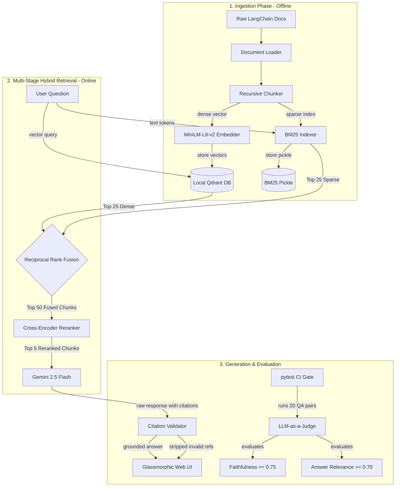

# 🎓 Master Interviewer Guide: Production RAG Application

This document serves as your complete guide to explaining this project in technical interviews. It is structured to help you communicate both **high-level systems architecture** and **deep machine learning/software engineering trade-offs** with absolute fluency.

---

## 🗺️ Architectural Diagram

---

## ⚡ Section 1: The 30-Second Elevator Pitch
*Use this when the interviewer asks: "Tell me about a project you're proud of" or "Walk me through your portfolio."*

> "I built a production-grade **hybrid retrieval-augmented generation (RAG)** application designed to answer technical questions over LangChain documentation. 
>
> The core problem I wanted to solve is that standard, vector-only RAG pipelines fail in production when handling highly specific technical terms, such as class names, code syntax, or exact API parameters. 
> 
> To solve this, I designed a **dual-retrieval pipeline** combining dense vector search and sparse BM25 keyword search, fused them using **Reciprocal Rank Fusion (RRF)**, and reranked the candidates using a local **Cross-Encoder model** running on CPU. 
> 
> Finally, I enforced verifiable citations to eliminate LLM hallucinations and set up a **CI-gated RAGAS evaluation pipeline** that automatically blocks code changes if the retrieval quality drops below set thresholds."

---

## 🚶‍♂️ Section 2: The 2-Minute Architectural Walk-Through
*Use this when they say: "Walk me through the architecture step-by-step."*

> "The system is divided into three key phases: Ingestion, Multi-Stage Retrieval, and Generation/Evaluation.
> 
> **First, during Ingestion:**
> We scrape the official LangChain documentation, split the pages using a `RecursiveCharacterTextSplitter` configured for semantic boundaries, and build a dual-index: a dense vector index in a local **Qdrant** database embedded using `all-MiniLM-L6-v2`, and a sparse keyword index using **BM25**.
> 
> **Second, during Online Query Retrieval:**
> When a user submits a query, we retrieve the top 25 candidates from both Qdrant and BM25 in parallel. Because keyword scores and vector cosine similarities live in different mathematical scales, we combine them using **Reciprocal Rank Fusion (RRF)** to generate a single, ranked list of 50 candidates based on rank position rather than raw score.
> 
> **Third, during Reranking & Context Construction:**
> We pass the 50 fused candidates through a local **Cross-Encoder model** (`ms-marco-MiniLM-L-6-v2`) running on CPU. This model evaluates the query and document chunks together, outputting high-precision relevance scores. We take the top 5 reranked chunks and inject them into our prompt context.
> 
> **Finally, during Generation and Validation:**
> We send the context to **Gemini 2.5 Flash** with strict system instructions to cite its sources using `[n]` notation. After generation, we run a custom **regex post-processor** to validate that every cited source is present in the context, stripping any hallucinated citations before serving the answer to our glassmorphic Web UI. 
> 
> For quality assurance, I implemented a CI pipeline using `pytest` and `RAGAS` that tests the pipeline against 20 curated QA pairs on every commit, gating deployment on faithfulness and relevance scores."

---

## 📘 Section 3: Core Concept Glossary (Speak Like a Specialist)
*When discussing specific components, use these exact definitions and industry terms.*

### 1. LangChain Core Abstractions
*   **The Runnable Interface (LCEL)**: 
    *   *Concept:* The core protocol in LangChain. Every component (LLM, Prompt, Parser, Retriever) implements `Runnable`, which standardizes synchronous, asynchronous, batching, and streaming interfaces via `.invoke()`, `.stream()`, and `.batch()`.
    *   *Why mention it:* It demonstrates that you understand how LangChain enforces type safety and stream-ability across diverse APIs.
*   **ChatModel vs. LLM**:
    *   *Concept:* A ChatModel accepts a list of structured messages (`SystemMessage`, `HumanMessage`, `AIMessage`) and outputs an `AIMessage`. An LLM takes a raw string and outputs a raw string.
    *   *Why mention it:* Shows you know modern conversational API standards versus legacy completion APIs.
*   **Retriever**:
    *   *Concept:* A functional abstraction that wraps any database (vector or keyword) and returns a list of LangChain `Document` objects.
    *   *Why mention it:* Decoupling your retrieval code from your specific database instance (Qdrant) is a core software engineering best practice.

### 2. LangGraph Stateful Orchestration
*   **Stateful Graph**:
    *   *Concept:* An orchestration framework that models workflows as graphs of nodes (functions) and edges (transitions). It maintains a persistent state dict that is passed and modified by each node.
    *   *Why we chose it:* Linear chains (`ChainA -> ChainB`) are brittle. LangGraph allows state management, error recovery loops, and conditional routing (e.g., checking if retrieval was successful before generating).
*   **State, Nodes, and Edges**:
    *   *State:* The shared memory structure (defined as a Python `TypedDict` or Pydantic class) that stores the intermediate values (`question`, `chunks`, `response`).
    *   *Nodes:* Functions that take the state, perform an operation (like calling a model), and return the updated state.
    *   *Edges:* The paths that connect nodes, which can be conditional based on state values.

### 3. Machine Learning & RAG Engineering
*   **Bi-Encoder (Embeddings)**:
    *   *Concept:* Embeds query and document separately into vectors, then compares them. Extremely fast (microseconds) but ignores word-to-word context between the query and the document.
*   **Cross-Encoder (Reranker)**:
    *   *Concept:* Processes query and document together through a transformer network. Highly accurate but slow. Perfect for reranking a small candidate set (e.g., top 50).
*   **Reciprocal Rank Fusion (RRF)**:
    *   *Concept:* Merges rankings from multiple search systems. The RRF score for a document is: $\sum_{m \in M} \frac{1}{k + r_m(d)}$ where $r_m(d)$ is the rank of document $d$ in system $m$, and $k$ is a constant (typically 60).
*   **LLM-as-a-Judge**:
    *   *Concept:* Using a highly capable LLM to evaluate generative outputs based on specific criteria (e.g., Faithfulness, Answer Relevance), turning qualitative evaluations into quantitative metrics.

---

## 💬 Section 4: Dealing with Hard Interview Questions

### Q1: "Why did you build a hybrid search pipeline? Isn't vector search enough?"
*   **The Pro Answer:** 
    > "Vector search excels at semantic matching—identifying conceptual intent. For example, if a user asks about 'persisting conversations,' it correctly retrieves docs about 'Memory' even if the word 'memory' isn't in the query.
    > 
    > However, vector search is notoriously bad at exact keyword matching. In developer documentation, users search for exact terms like `ChatPromptTemplate`, `LCEL`, or `RunnablePassthrough`. Vector search often ranks these lower because it looks at general semantic similarity rather than exact string matches.
    > 
    > BM25 acts as a high-precision filter for technical terms. By running both and fusing their outputs via RRF, we get the best of both worlds: semantic understanding *and* exact keyword matching."

### Q2: "Why did you use Reciprocal Rank Fusion (RRF) instead of just multiplying or adding the search scores?"
*   **The Pro Answer:**
    > "BM25 scores and Vector similarity scores are mathematically incompatible. BM25 is an unbounded frequency-based score (e.g., `12.5`), whereas cosine similarity is bounded between `-1` and `1`. 
    > 
    > Adding or multiplying them directly requires complex normalization, which changes depending on the query and the document length. 
    > 
    > RRF bypasses this completely by only looking at the **rank index** (1st place, 2nd place, etc.). It is parameter-free, highly robust, and guarantees that a document appearing in the top ranks of both search strategies will outrank documents that only score highly in one."

### Q3: "Cross-encoders are computationally expensive. How did you justify running one on a local CPU?"
*   **The Pro Answer:**
    > "If we ran the cross-encoder on all 500 documents in our collection, it would block the main thread for seconds. 
    > 
    > Instead, we use a two-stage retrieval pattern. Stage 1 uses fast bi-encoder embeddings and BM25 to filter out the irrelevant 90% of documents, yielding 50 high-quality candidates in milliseconds. 
    > 
    > Stage 2 runs a tiny, highly optimized cross-encoder (`ms-marco-MiniLM-L-6-v2`, ~90MB) on just those 50 candidates. On a standard CPU, this takes less than 80ms. The quality boost we get from word-to-word context matching easily justifies this minor 80ms latency trade-off."

### Q4: "How does your citation validator handle hallucinations?"
*   **The Pro Answer:**
    > "LLMs are prone to 'citation hallucination'—they will randomly output markers like `[6]` or `[7]` even if we only provided 5 source documents. 
    > 
    > To prevent this, our LangGraph pipeline ends with a `validate_citations` node. It parses the LLM response using regex, checks every citation number against the size of the retrieved context list, and strips out invalid numbers. 
    > 
    > It also extracts the matching source metadata (title, URL, excerpt) and returns it in a structured JSON payload alongside the cleaned answer, ensuring the frontend only displays verifiable source cards."

### Q5: "How did you set up the CI gate for RAG quality, and what metrics did you track?"
*   **The Pro Answer:**
    > "A major problem in RAG is that a prompt change or chunking adjustment can silently degrade answer quality. To prevent this, I wrote a test suite in `tests/test_eval_gate.py` that runs in GitHub Actions.
    > 
    > We evaluate the pipeline against a test dataset using an LLM-as-a-judge pattern to measure:
    > 1. **Faithfulness:** Checking if the generated answer can be strictly inferred from the source documents. (Hallucination detector).
    > 2. **Answer Relevance:** Measuring how well the generated response directly addresses the user's question.
    > 
    > If the average scores drop below 0.75 for faithfulness or 0.70 for relevance, the pytest execution fails, which blocks the pull request from being merged. This treats quality degradation exactly like a failing unit test or a drop in code coverage."
